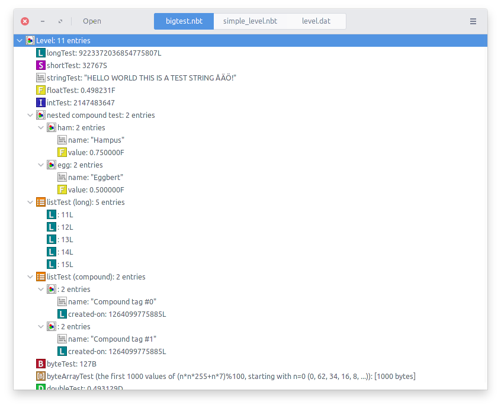

# NBTk

Very basic and very WORK IN PROGRESS gtk3 NBT editor, written in C++, based on [nbtpp](https://github.com/M4xi1m3/nbtpp).

## Current state

Can open NBT files, regardless of the compression (uncompresses/zlib/gzip) and parses every tags. Currently no edition avaliable.

## Screenshot

## License and attribution

NBTk is released under the [MIT license](LICENSE)

The [NBTk logo](imgs/logo.xcf) is released under CC-BY-SA

[NBT Icons](imgs/tags) were taken from [the minecraft wiki](https://minecraft.gamepedia.com/File:Nbtsheet.png) and are released under CC-BY

